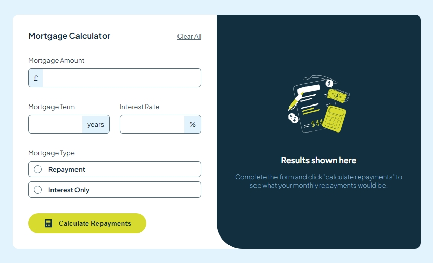
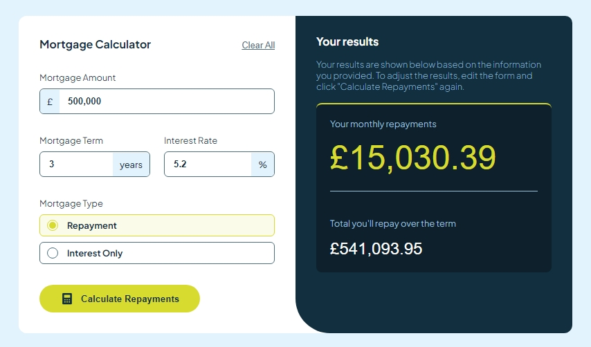

# Mortgage Calculator App

## Overview

The **Mortgage Calculator App** helps users calculate their monthly repayments and total repayment amounts over a mortgage term. It supports two types of mortgages:

1. Repayment Mortgage
2. Interest-Only Mortgage

The app also provides error handling, input validation, and interactive features such as live number formatting for amounts.

---

## Screenshots

### Screenshot 1

### Screenshot 2

### Screenshot 3

## Features

### Core Functionalities

- **Input Validation:** Ensures users enter valid numeric values. Displays error messages for:
  - Empty fields
  - Invalid numbers
  - Negative values
  - Zero amounts (for specific inputs)
- **Calculation:** Computes results for:
  - Monthly repayments
  - Total repayments over the term
- **Dynamic Display:** Shows results in a formatted and visually appealing way.
- **Clear Inputs:** Allows users to reset all fields and clear displayed results.

### Interactive Features

- **Live Formatting:** Automatically formats large numbers in the "Amount" input with commas (e.g., `1234567` becomes `1,234,567`).
- **Dynamic Error Display:** Highlights errors and removes them once corrected.
- **Responsive Design:** Ensures the app is usable on various devices.

---

## Technologies Used

- **HTML:** Structure of the form and results display.
- **SCSS:** Custom styling for the app.
- **TypeScript/JavaScript:** Handles input validation, live formatting, calculations, and DOM manipulation.

---

## Project Structure

---

## How It Works

### User Workflow

1. **Input Data:**
   - Enter the mortgage amount, term (in years), and interest rate.
   - Select the type of mortgage.
2. **Calculate Repayments:**
   - Click the "Calculate Repayments" button to generate monthly and total repayments.
3. **View Results:**
   - Results are displayed dynamically in a structured layout.
4. **Clear Data:**
   - Use the "Clear" button to reset the form and results.

### Input Validation

- **Amount:**
  - Must be a valid number.
  - Cannot be negative or zero.
- **Term:**
  - Positive integer value.
  - Cannot be negative or zero.
- **Interest Rate:**
  - Must be a valid percentage (e.g., `2.5`).
  - Cannot be negative or zero.

### Live Formatting

- The **Amount** field automatically formats numbers with commas as you type, improving readability.
